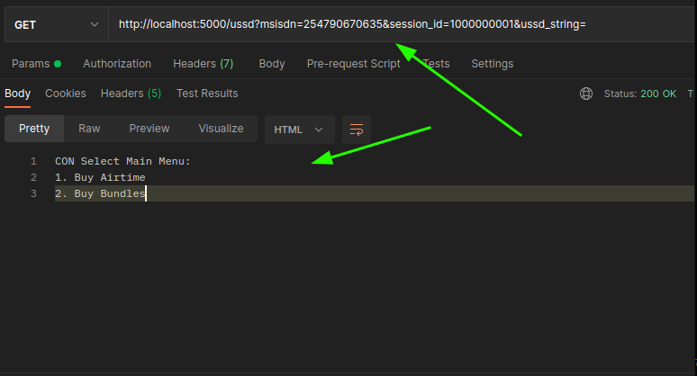
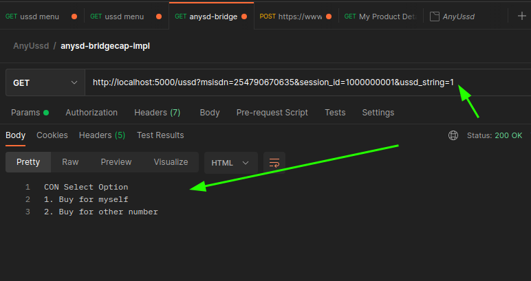

# AnySD


AnySD (Any USSD) is a package with classes to help you quickly write ussd (or ussd-like) applications.


### Understanding Anysd ussd

---
#### Anysd
Anysd uses [anytree](https://pypi.org/project/anytree/) to build a tree navigation, 
and [redis](https://pypi.org/project/redis/) for tracking navigation and session data (variables)
*Therefore, you need redis to continue*

#### ussds
Ussd applications have 2 main components

1. **A Form** - for taking input from the user
2. **Navigation** - How to reach the beginning of a form, by selecting options

## Getting started

---

### Install anysd in virtual environment
Create and activate a virtualenv, then
Install `anysd` if you have not: 
```
>>> mkdir anysdtest && cd anysdtest

>>> virtualenv venv
created virtual environment CPython3.8.10.final.0-64 in 4591ms
  creator CPython3Posix(dest=/home/steven/workspace/anysdtest/venv, clear=False, no_vcs_ignore=False, global=False)
  seeder FromAppData(download=False, pip=bundle, setuptools=bundle, wheel=bundle, via=copy, app_data_dir=/home/steven/.local/share/virtualenv)
    added seed packages: pip==22.0.4, setuptools==62.1.0, wheel==0.37.1
  activators BashActivator,CShellActivator,FishActivator,NushellActivator,PowerShellActivator,PythonActivator

>>> source venv/bin/activate
(venv) >>>
(venv) >>> pip install anysd

...

(venv) >>> pip install Flask

```

### Building the ussd

To build a ussd application, we first need to define the menus, first a home screen (or starting point), 
then the other menus descending from the home menu

In this example, we want a ussd to buy airtime and bundles. Then for each selection, we'll need to get the phone number
of the receiver. For airtime, we need amount, and for bundles, we'll select a bundle option

**step 1: Build the questions**

```python
# validator.py

from anysd import FormFlow, ListInput
airtime_questions = {
    "1": {'name': 'AIRTIME_RECEIVER', 'menu': ListInput(items=['Buy for myself', 'Buy for other number'], title='Select Option')},
    '2': {'name': 'AIRTIME_AMOUNT', 'menu': 'Enter amount'},
    '3': {'name': 'CONFIRMATION', 'menu': 'You are about to buy {amount} airtime for {receiver}\n1. Confirm\n0. Cancel'}
}

bundle_packages = [
    '100mb @15 valid 24 hours',
    '1GB @40 valid 24 hours',
    '5GB @100 valid 7 days'
]
bundle_questions = {
    "1": {'name': 'BUNDLE_RECEIVER', 'menu': ListInput(items=['Buy for myself', 'Buy for other number'], title='Select Option')},
    '2': {'name': 'BUNDLE_PACKAGE', 'menu': ListInput(items=bundle_packages, title='Select package')},
    '3': {'name': 'CONFIRMATION', 'menu': 'You are about to buy {package} for {receiver}\n1. Confirm\n0. Cancel'}
}


```

**step 2: create form validators**

By default, list inputs will be validated, but it's good you write another validator.
In validation, you specify what conditions make a user input invalid, and return either true or false on the user input.
Also, you can modify the input, if you need to
Note: the validators should accept extra `kwargs` that may be passed 

```python
# validator.py

def airtime_validator(current_step, last_input: str, **kwargs):
    valid = True
    validated = None  # in case we want to modify user input, 
    
    if current_step == 2:
        if not last_input.isnumeric():  # checking if amount is a numeric value
            valid = False
        elif int(last_input) < 5:  # checking if is less than minimum 
            valid = False
    
    elif current_step == 3:
        if last_input not in ['1', '0']:
            valid = False
    
    return valid, validated

def bundle_validator(current_step, last_input: str, **kwargs):
    valid = True
    validated = None  # in case we want to modify user input, 
    
    if current_step == 3:
        if last_input not in ['1', '0']:
            valid = False
    
    return valid, validated
```
*Note: Without step validators, all inputs except for List inputs(so far), will be assumed to be valid*

**step 3: Build the navigation**

Link the menu, with the forms
```python
# menu.py

from anysd import NavigationMenu, FormFlow
from validator import *


# forms
airtime_form = FormFlow(form_questions=airtime_questions, step_validator=airtime_validator)
bundle_form = FormFlow(form_questions=bundle_questions, step_validator=bundle_validator)

# menus
home = NavigationMenu(name="Home", title="Main Menu", show_title=True)

buy_airtime = NavigationMenu(name="airtime_home", title="Buy Airtime", parent=home, next_form=airtime_form)
buy_bundles = NavigationMenu(name="bundles_home", title="Buy Bundles", parent=home, next_form=bundle_form)
```

**step 4: Navigation controller**

The `NavigationController` object will be used to bind things together. It takes in `msisdn`, `session_id` and `ussd_string` plus your navigation `home`, then responds
with an appropriate response.

We will call this inside a simple flask application.

If you haven't, install flask: `pip install flask` in your virtualenv

```python
from flask import Flask, request
from anysd import NavigationController
from menu import home

app = Flask(__name__)

@app.get('/ussd')
def ussd_app():

    msisdn = request.args.get('msisdn')
    session_id = request.args.get('session_id')
    ussd_string = request.args.get('ussd_string')

    print(f"{msisdn} :: {session_id} ::: {ussd_string}")
    navigator = NavigationController(home, msisdn, session_id, ussd_string)
    msg = navigator.navigate()

    return msg


if __name__ == '__main__':
    app.run()
```

**BEFORE WE RUN OUR BEAUTIFUL USSD, Anysd uses redis to store session data. We therefore need to specify the connection to redis in a config.yaml file**

```yaml
# config.yaml

redis:
    host: localhost
    port: 6379
    db: 4
```

Now we are ready to run the application:

```
(venv) >>> flask run 
* Environment: production
   WARNING: This is a development server. Do not use it in a production deployment.
   Use a production WSGI server instead.
 * Debug mode: off
2022-05-27 11:52:03,350 INFO   _log (on line 224 ) :  * Running on http://127.0.0.1:5000 (Press CTRL+C to quit)

```

Our flask application will receive `GET` requests in this format: `http://host:port/ussd?msisdn=XXXXXXXXXXXX&session_id=XXXXXXXXXXXXX&ussd_string=XXX*XXX*XXX`

Now Let's use postman to hit the endpoint



Now let's select option 1 and see what happens:




**Congratulations**. you have built a basic ussd application, with one level of navigation and a form.
We'll make more lessons on how to use anysd.

### This is a new project, so many features are going to be added, progressively


